<h1 align="center">Socket Lovers</h1>
<h3 align="center">Message your friends (and enemies) in real time!</h3>
<p align="center">
    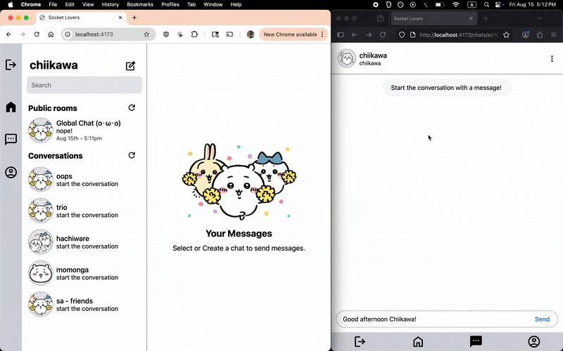
</p>

### Features

- Realtime messaging with sockets (messages saved on server)
- Private, Group, Public chats
- Create, rename, delete private & group chats
- Customize user profile picture and bio (saved to cloud storage)
- User signup / login
- Desktop and mobile design

## Endpoints & Socket Events

| Method | URI                   | Function               | Token | Body                                | Notes         |
| ------ | --------------------- | ---------------------- | ----- | ----------------------------------- | ------------- |
| POST   | /signup               | Create user            | N     | { username, password}               |               |
| POST   | /login                | Login user             | N     | { username, password}               |               |
| GET    | /current              | Retrieve current user  | Y     |                                     |               |
| GET    | /users                | Retrieve all users     | Y     |                                     |               |
| GET    | /users/:userId        | Retrieve user data     | Y     |                                     |               |
| PATCH  | /users/:userId        | Update bio             | Y     | { bio }                             |               |
| PATCH  | /users/:userId/avatar | Update profile picture | Y     | { avatar }                          |               |
| GET    | /chats-public         | Retrieve public chats  | Y     |                                     |               |
| GET    | /chats                | Retrieve chats         | Y     |                                     |               |
| POST   | /chats                | Create chat            | Y     | { name, userIds: ['id_1', 'id_2'] } |               |
| GET    | /chats/:chatId        | Retrieve chat          | Y     |                                     |               |
| PATCH  | /chats/:chatId        | Update chat name       | Y     | { name }                            | name optional |
| DELETE | /chats/:chatId        | Delete chat            | Y     |                                     |               |

| Socket Event      | Arguments      | Use                              |
| ----------------- | -------------- | -------------------------------- |
| 'connection'      | token          | socket connection                |
| 'send_message'    | token, message | sending messages                 |
| 'receive_message' | message        | notify client to update messages |
| 'join_room'       | token, chatId  | join chat                        |
| 'disconnecting'   |                | leave rooms before disconnect    |
| 'disconnect'      |                | log id has disconnected          |

## Stack

```
client/            # Frontend (React, Vite, Tailwind, etc.)
server/            # Backend (Express, Prisma, Passport, etc.)
```

### Frontend

- React (with Vite)
- React Router
- Tailwind CSS
- Socket.io for real-time communication
- Motion for smooth animations
- Date-fns for date formatting

### Backend

- Node.js with Express for REST API
- Prisma ORM w/ PostgreSQL database
- Socket.io
- Supabase Storage for saving user uploaded profile pictures
- Multer and Sharp for file upload and image processing
- Express validator for endpoint input validation
- Jsonwebtoken & bcryptjs from authentication / authorization

## App Showcase

| New conversation (gif)                                     |
| ---------------------------------------------------------- |
| 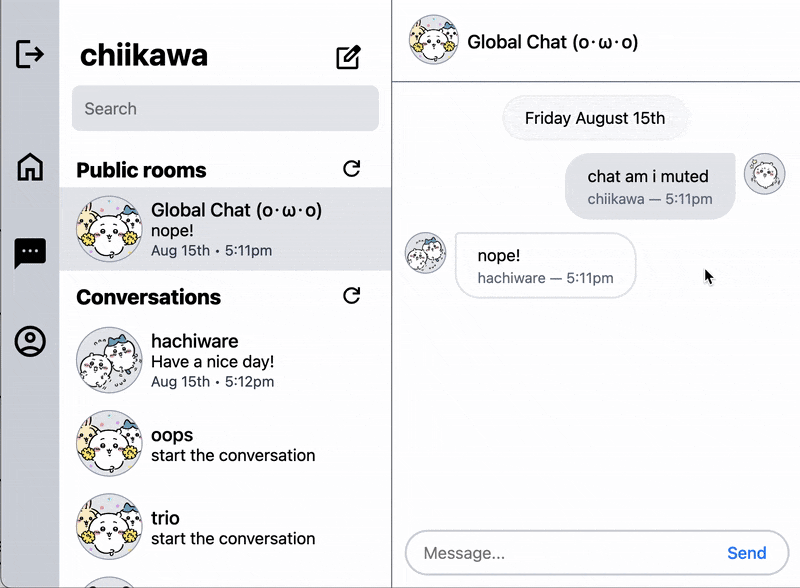 |

| Edit profile (gif)                                        |
| --------------------------------------------------------- |
| 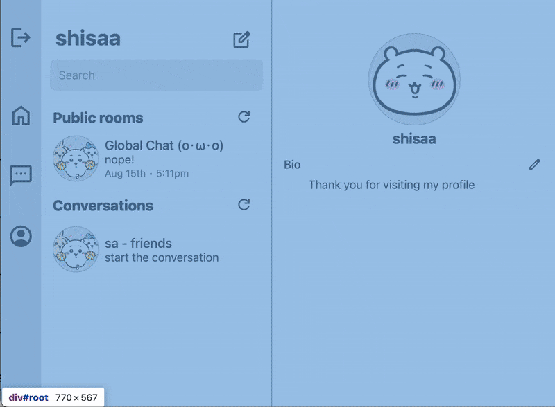 |

| Loading animations (NEATO GIF!)                                 |
| --------------------------------------------------------------- |
| 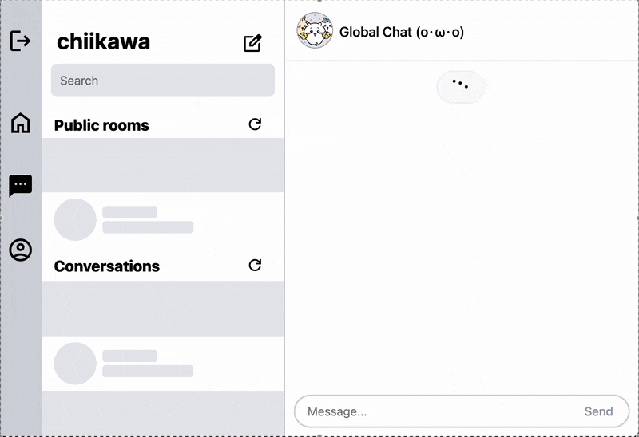 |

| View profile                                                   | Rename conversation                                        | Delete conversation                                        |
| -------------------------------------------------------------- | ---------------------------------------------------------- | ---------------------------------------------------------- |
| 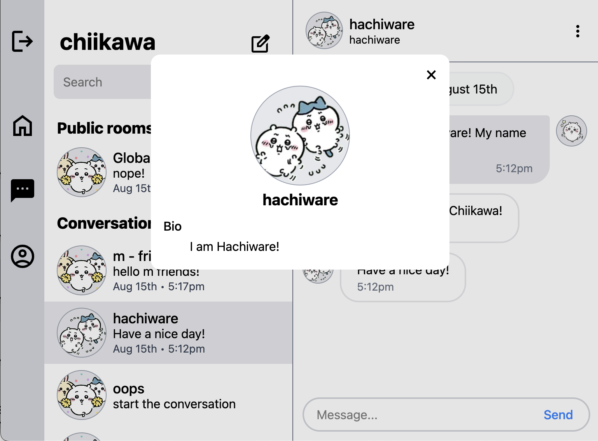 | 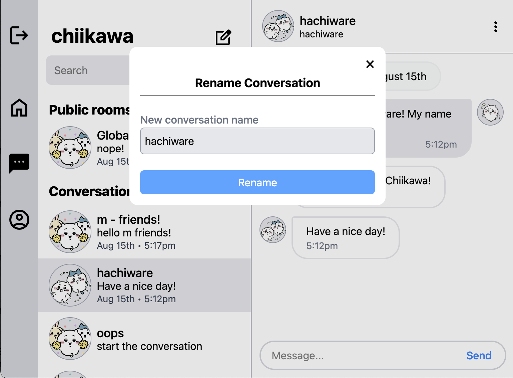 | 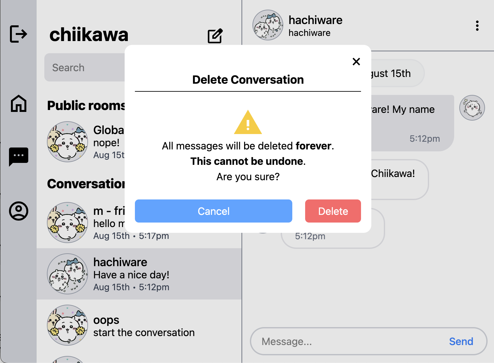 |

| Message - Group chat                                         | Message - Private chat                                         | Refresh button animation (gif)                              |
| ------------------------------------------------------------ | -------------------------------------------------------------- | ----------------------------------------------------------- |
| 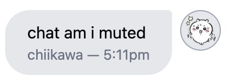 | 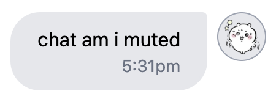 | 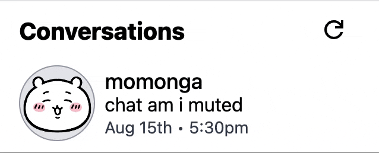 |

| Error                                                | Login                                                | Signup                                                |
| ---------------------------------------------------- | ---------------------------------------------------- | ----------------------------------------------------- |
| 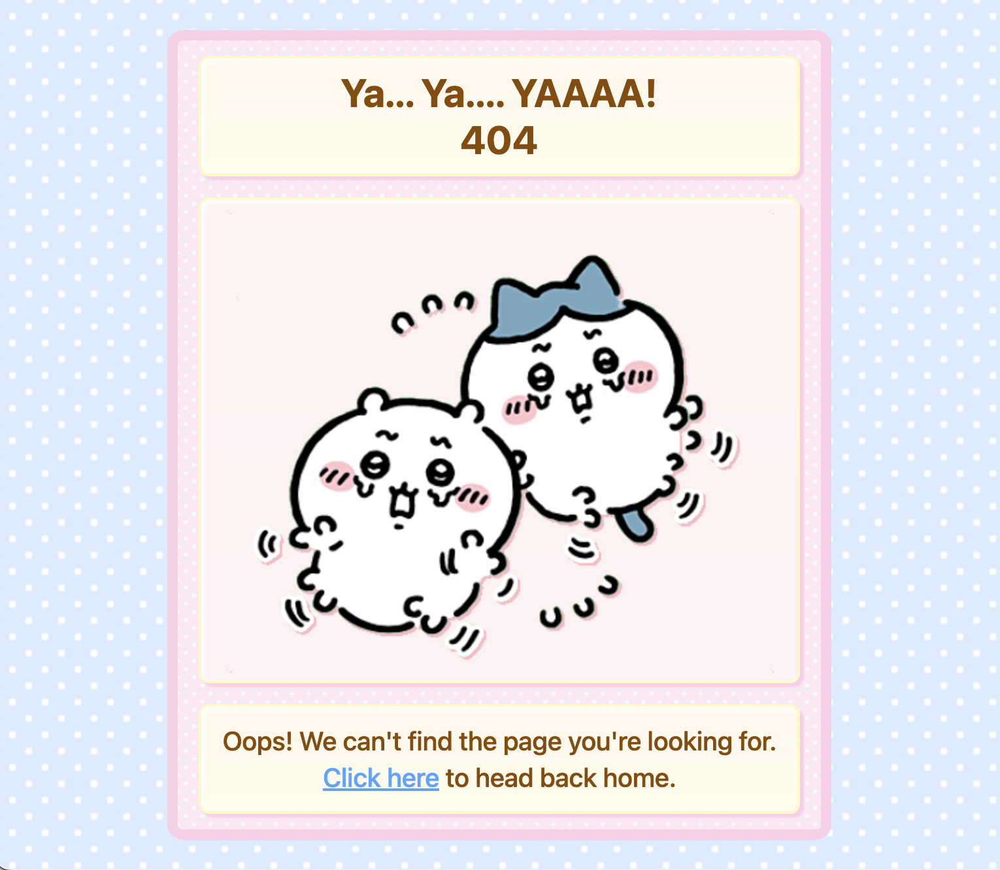 | 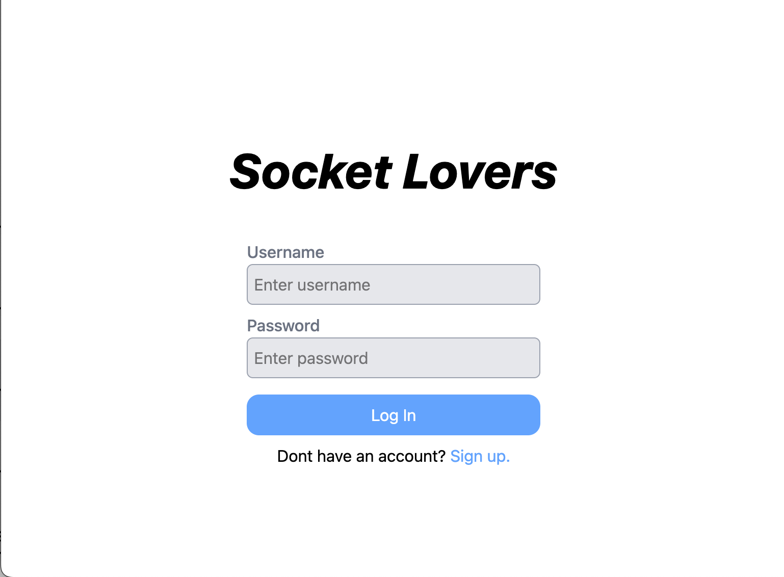 | 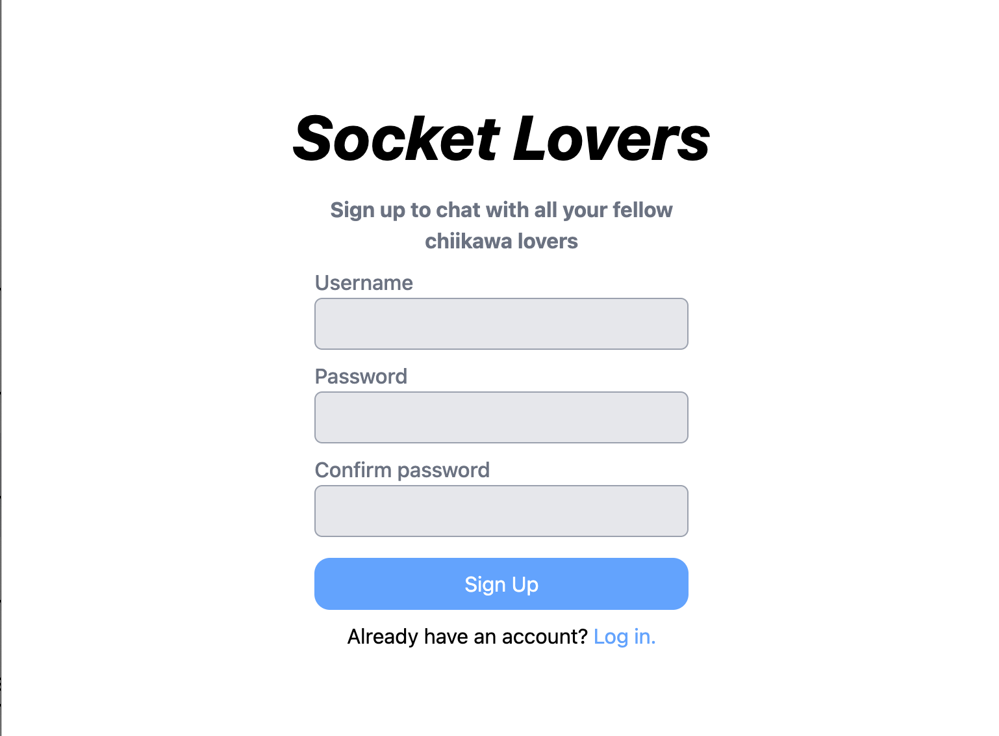 |

## Learning Outcomes

- Interaction
    - Configuring API to require minimal data manipulation from client
    - Emphasizing encapsulation and separation of concerns

- Backend
    - Utilizing Socket.io to implement real time chatting
    - Uploading profile pictures
        - Retrieve photo from form with multer
        - Resize, compress, and reformat the image to webp with sharp
        - Store on supabase with supabase storage
            - supabase: create project -> get url + key -> create bucket policy -> go nuts
    - Chat signatures to enforce one chat for each unique group of users
    - Seeding Public chats on server startup
    - Prisma Enums

- Frontend
    - Utilizing Socket.io-client to receive message updates
    - Extracting API logic away from components (My code is so clean now!)
    - vite default env variables!
    - first time using tailwind! I like it :)
    - Creating my own loading animations (more elaborate and fitting the UI)!

### Retrospective aka yapping

This project has been a little over 2 months in the making. My first chat app, [Steel Ball Messenger](https://github.com/JellyRollJunior/steel-ball-messenger), was a messy, confusing, uncertain process. However, I learned the most from this process. I decided to remake the app and add more features. This is the outcome!

I am very proud of this project. I really took time to plan out the architecture which made a huge difference in the enjoyability and ease of development. There is less mental strain when each module has it's own concern!

## Start commands

```bash
# Start backend server
cd server
npm install
node --watch server.js
```

```bash
# Start frontend react
cd client
npm install
npm run dev

# OR
cd client
npm install
npm run build
npm run preview
```

### Environment variables

```bash
# ./backend/.env
PORT
SERVER_URI
CLIENT_URI
DATABASE_URL
TOKEN_SECRET
SOCKET_ADMIN_USERNAME
SOCKET_ADMIN_PASSWORD
SUPABASE_URL
SUPABASE_KEY
SUPABASE_DEFAULT_CHAT_AVATAR
SUPABASE_DEFAULT_GROUP_CHAT_AVATAR

# ./client/.env
VITE_SERVER_URL
```

## Acknowledgements

| Usage  | Source                                                                          |
| ------ | ------------------------------------------------------------------------------- |
| Images | Chiikawa                                                                        |
| Icons  | Google material icons                                                           |
| Specs  | [The Odin Project](https://www.theodinproject.com/lessons/nodejs-messaging-app) |
